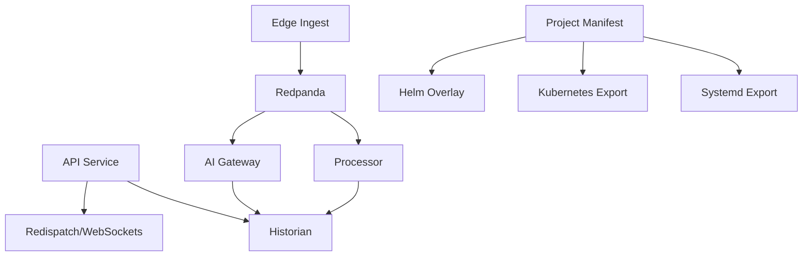

# Implementation Graph - 2026-07-02

## Goal

Harden the runtime contracts for self-hosted industrial rollout without changing user-facing functionality.

## Graph

## Current Focus

- [services/api_service/main.py](../../services/api_service/main.py)
- [services/api_service/runtime.py](../../services/api_service/runtime.py)
- [services/api_service/auth.py](../../services/api_service/auth.py)
- [services/historian/client.py](../../services/historian/client.py)
- [services/processor/runtime_processor.py](../../services/processor/runtime_processor.py)
- [services/ai_gateway/main.py](../../services/ai_gateway/main.py)
- [services/common/project_manifest.py](../../services/common/project_manifest.py)

## Completed

- historian query table allowlist
- default-secret visibility for auth health checks
- local-origin CORS default
- Kafka producer reuse on API publish path
- manual offset commit after successful processor and AI gateway batch work
- implementation tracking note linked to current hardening pass

## Risks Being Addressed

- duplicate ingest/publish logic
- consumer auto-commit before durable work
- wide-open CORS and weak auth defaults
- query table names not constrained to known historian tables
- deployment generation mixed into manifest modeling

## Verification

- focused unit tests
- focused benchmark runs
- vault notes updated with results and decisions

## Latest Results

- `python -m compileall services tests`: passed
- focused regression tests: 56 passed
- `datastreamctl benchmark deployment-pack --events 10000 --batch-size 256`
  - export generation: 660.06 files/sec
  - replay: 61,037.32 events/sec
- `datastreamctl benchmark deployment-pack-matrix --events 10000 --batch-size 256`
  - average export generation: 653.31 files/sec
  - average replay: 63,654.18 events/sec
- `benchmark_mixed_replay.py --events 10000 --batch-size 256`
  - 54,779.87 events/sec
