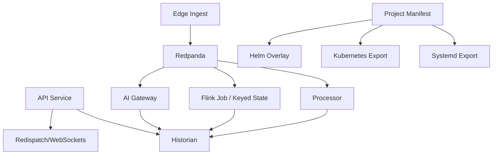

# Implementation Graph - 2026-07-02

## Goal

Harden the runtime contracts for self-hosted industrial rollout without changing user-facing functionality.

## Graph

## Current Focus

- [services/api_service/main.py](../../services/api_service/main.py)
- [services/api_service/runtime.py](../../services/api_service/runtime.py)
- [services/api_service/auth.py](../../services/api_service/auth.py)
- [services/historian/client.py](../../services/historian/client.py)
- [services/processor/runtime_processor.py](../../services/processor/runtime_processor.py)
- [services/ai_gateway/main.py](../../services/ai_gateway/main.py)
- [services/common/project_manifest.py](../../services/common/project_manifest.py)
- [services/benchmarks/cgr_stream_slice.py](../../services/benchmarks/cgr_stream_slice.py)
- [services/benchmarks/cgr_gap.py](../../services/benchmarks/cgr_gap.py)

## Completed

- historian query table allowlist
- default-secret visibility for auth health checks
- local-origin CORS default
- Kafka producer reuse on API publish path
- manual offset commit after successful processor and AI gateway batch work
- implementation tracking note linked to current hardening pass
- Prometheus-style metrics for historian query latency, broker consumer lag, and WebSocket delivery lag
- explicit site boundary enforcement for manifest sources
- length-safe default JWT placeholder and auth health strength reporting
- real-world simulator benchmark runner for mock and mixed replay cases
- bearer-token enforcement for mutating API requests with baseline security headers
- regression tests for shared-deployment auth and headers
- site-profile benchmark matrix for per-site acceptance runs
- project-manifest rollout acceptance command that combines release-gate and benchmark checks
- CGR gap report command that compares local benchmark numbers to the public CGR streaming claim
- isolated CGR-style stream slice benchmark and gap report integration
- CGR stream slice microbenchmark decomposition for validation, normalization, partitioning/window/scoring, and serialization
- shared runtime enrichment contract extracted into `services/processor/runtime_pipeline.py`
- distributed Flink processor wired as a keyed-state job with checkpointing while preserving the Python fallback path

## Risks Being Addressed

- duplicate ingest/publish logic
- consumer auto-commit before durable work
- wide-open CORS and weak auth defaults
- query table names not constrained to known historian tables
- deployment generation mixed into manifest modeling
- ambiguous source/site assignments in the project manifest
- invisible lag on historian query and stream delivery paths
- missing runnable benchmark matrix for repeatable real-world simulation cases
- missing per-site acceptance benchmark matrix
- missing first-class CGR gap report
- unauthenticated mutating API requests in shared deployments

## Verification

- focused unit tests
- focused benchmark runs
- vault notes updated with results and decisions
- CGR gap report verified against the current local benchmark pack
- replay p99 latency probes added to the mixed replay and simulator benchmark paths

## Latest Results

- `python -m compileall services tests`: passed
- focused regression tests: 23 passed
- `datastreamctl benchmark deployment-pack --events 10000 --batch-size 256`
  - export generation: 728.91 files/sec
  - replay: 64,775.69 events/sec
- `datastreamctl benchmark deployment-pack-matrix --events 10000 --batch-size 256`
  - average export generation: 718.80 files/sec
  - average replay: 61,813.35 events/sec
- `benchmark_mixed_replay.py --events 10000 --batch-size 256`
  - 58,548.76 events/sec
- focused regression slice after observability + site-boundary hardening: 23 passed
- `site-profile-matrix --site-ids demo-site,plant-a --events 20 --batch-size 4 --min-average-events-per-second 1`
  - demo-site: 44,795.24 events/sec, passed
  - plant-a: 59,253.75 events/sec, passed
  - overall: passed
- `project-manifest rollout-acceptance config/project-manifest.yaml --site-ids demo-site,plant-a --events 20 --batch-size 4 --min-average-events-per-second 1 --skip-network --skip-backup`
  - demo-site: release-gate passed, benchmark passed at 48,558.93 events/sec
  - plant-a: release-gate passed, benchmark passed at 55,973.26 events/sec
  - overall: passed
- manifest validation now enforces site boundary markers in source topics and explicit cross-site bridge/correlation strategies
- `benchmark site-profile-calibration --manifest config/project-manifest.yaml --csv data/benchmarks/industrial_mixed_benchmark.csv --site-ids demo-site,plant-a --events 20 --batch-size 4 --min-average-events-per-second 1`
  - demo-site: observed 52,786.52 events/sec, threshold 500.0, recommended minimum 42,229.22, batch 256
  - plant-a: observed 47,759.79 events/sec, threshold 750.0, recommended minimum 38,207.83, batch 256
  - overall: passed
- added a public simulation source catalog covering ICS datasets, process datasets, and protocol simulators for benchmark traffic generation
- datastream-import now converts AI4I, C-MAPSS, and generic CSV slices into the benchmark replay format
- `benchmark cgr-gap-report --manifest config/project-manifest.yaml --csv data/benchmarks/industrial_mixed_benchmark.csv --site-ids demo-site,plant-a --events 10000 --batch-size 256 --warmup-events 0 --min-average-events-per-second 1`
  - documented full pipeline reference: 125,830.00 events/sec
  - mixed replay: 65,876.93 events/sec, p99 0.0237 ms
  - isolated CGR-style stream slice: 21,215.99 events/sec, p99 0.1050 ms
  - real-world simulator average: 67,690.83 events/sec, p99 0.0313 ms
  - site-profile average: 67,358.66 events/sec, p99 0.0297 ms
  - site-profile best latency run: plant-a at 0.0275 ms p99
- the internal record migration was compatible with the existing tests and benchmark commands
- the isolated stream slice improved materially after the migration
- `benchmark cgr-stream-slice --events 10000 --batch-size 256 --warmup-events 0`
  - mapping + validation: 137,972.90 ops/sec
  - record build: 61,408.84 ops/sec
  - partitioning + rolling window + scoring: 161,477.85 ops/sec
  - serialization: 63,204.73 ops/sec
- the bottleneck moved from rolling-window math to record packing and serialization after the migration
