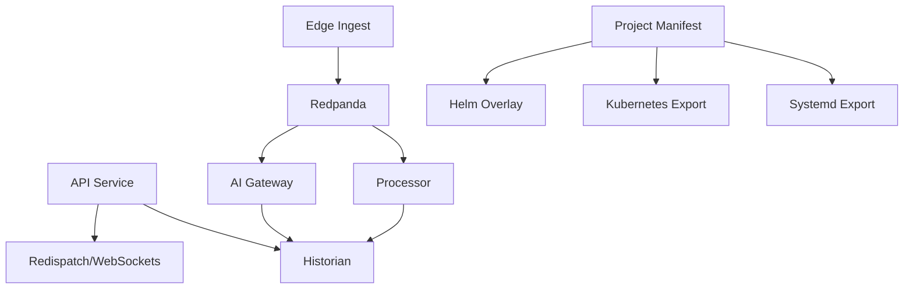

# Implementation Graph - 2026-07-02

## Goal

Harden the runtime contracts for self-hosted industrial rollout without changing user-facing functionality.

## Graph

## Current Focus

- [services/api_service/main.py](../../services/api_service/main.py)
- [services/api_service/runtime.py](../../services/api_service/runtime.py)
- [services/api_service/auth.py](../../services/api_service/auth.py)
- [services/historian/client.py](../../services/historian/client.py)
- [services/processor/runtime_processor.py](../../services/processor/runtime_processor.py)
- [services/ai_gateway/main.py](../../services/ai_gateway/main.py)
- [services/common/project_manifest.py](../../services/common/project_manifest.py)

## Completed

- historian query table allowlist
- default-secret visibility for auth health checks
- local-origin CORS default
- Kafka producer reuse on API publish path
- manual offset commit after successful processor and AI gateway batch work
- implementation tracking note linked to current hardening pass
- Prometheus-style metrics for historian query latency, broker consumer lag, and WebSocket delivery lag
- explicit site boundary enforcement for manifest sources
- length-safe default JWT placeholder and auth health strength reporting
- real-world simulator benchmark runner for mock and mixed replay cases
- bearer-token enforcement for mutating API requests with baseline security headers
- regression tests for shared-deployment auth and headers
- site-profile benchmark matrix for per-site acceptance runs

## Risks Being Addressed

- duplicate ingest/publish logic
- consumer auto-commit before durable work
- wide-open CORS and weak auth defaults
- query table names not constrained to known historian tables
- deployment generation mixed into manifest modeling
- ambiguous source/site assignments in the project manifest
- invisible lag on historian query and stream delivery paths
- missing runnable benchmark matrix for repeatable real-world simulation cases
- missing per-site acceptance benchmark matrix
- unauthenticated mutating API requests in shared deployments

## Verification

- focused unit tests
- focused benchmark runs
- vault notes updated with results and decisions

## Latest Results

- `python -m compileall services tests`: passed
- focused regression tests: 23 passed
- `datastreamctl benchmark deployment-pack --events 10000 --batch-size 256`
  - export generation: 728.91 files/sec
  - replay: 64,775.69 events/sec
- `datastreamctl benchmark deployment-pack-matrix --events 10000 --batch-size 256`
  - average export generation: 718.80 files/sec
  - average replay: 61,813.35 events/sec
- `benchmark_mixed_replay.py --events 10000 --batch-size 256`
  - 58,548.76 events/sec
- focused regression slice after observability + site-boundary hardening: 23 passed
- `site-profile-matrix --site-ids demo-site,plant-a --events 20 --batch-size 4 --min-average-events-per-second 1`
  - demo-site: 44,795.24 events/sec, passed
  - plant-a: 59,253.75 events/sec, passed
  - overall: passed
